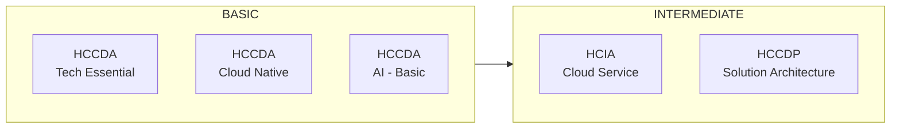

# Huawei Cloud & AI Learning Path

### A structured roadmap through Huawei Cloud certifications — from fundamentals to advanced architecture

---

## Platforms

| Platform | Purpose | Link |
|---|---|---|
| ICT Academy Huawei | Official talent portal — course catalog & certification tracking | [Open Portal](https://e.huawei.com/en/talent/portal/#/) |
| Koolab Huawei | Hands-on cloud labs & experiments | [Open Labs](https://lab.huaweicloud.com/intl/en-us/experiment-list) |
| Huawei Career Certification | Overview of HCIA / HCIP / HCIE certification levels and process | [View Page](https://e.huawei.com/en/talent/cert/#/careerCert) |
| Huawei ICT Academy Home | Program overview, technical fields, and course tracks | [View Page](https://e.huawei.com/en/talent/ict-academy/#/home) |
| Certificate Verification | Verify a Huawei certificate by serial number | [Verify Here](https://e.huawei.com/en/talent/#/cert/certificate-verification) |

> Both learning portals require login and are JavaScript-rendered — sign in first, then use the direct course links below to jump straight to a module.

---

## Roadmap Overview

---

## Level: BASIC

### Tech Essential
- [ ] **HCCDA – Tech Essential**
  [Start Course](https://e.huawei.com/en/talent/outPage/#/sxzcourse/home?courseId=sxbeQMhQoMTb_UvcX23MlhiiGQc)

### Cloud Native
- [ ] **HCCDA – Cloud Native**
  [Start Course](https://e.huawei.com/en/talent/outPage/#/sxzcourse/home?courseId=GapNMQ9MK3TE-SFUq1XnWNWUnqc)

### AI – Basic
- [ ] **HCCDA – AI**
  [Start Course](https://connect.huaweicloud.com/intl/enus/courses/learn/learning/sp:cloudEdu_en?courseNo=C10171679826865855&courseType=1&source=1)

---

## Level: INTERMEDIATE

### Cloud Service
- [ ] **HCIA – Cloud Service**
  [Start Course](https://e.huawei.com/en/talent/outPage/#/sxzcourse/home?courseId=sYenYdeK3L3E3_0eJRVy1o1Pj6k)

### Solution Architecture
- [ ] **HCCDP – Solution Architecture**
  [Start Course](https://e.huawei.com/en/talent/outPage/#/sxzcourse/home?courseId=I4bs1u--tD4kL8Fg3clrbgvqnhA)

---

## Additional Resources

| Resource | Description | Link |
|---|---|---|
| Learning & Certification Services | Huawei's official page on certification tiers (HCIA/HCIP/HCIE) and training centers | [View](https://e.huawei.com/en/solutions/services/learning-and-certification) |
| Huawei ICT Academy (Wikipedia) | Background on the global program, partner universities, and course catalog scope | [View](https://en.wikipedia.org/wiki/Huawei_ICT_Academy) |

> Note: These are general program/reference pages, not individual course links. Use them to explore HCIP and HCIE tracks once you complete the Basic and Intermediate courses above, since those advanced course IDs are assigned per learner inside the portal.

---

## Progress Tracker

| # | Course | Level | Status |
|---|---|---|---|
| 1 | HCCDA – Tech Essential | Basic | Not started |
| 2 | HCCDA – Cloud Native | Basic | Not started |
| 3 | HCCDA – AI | Basic | Not started |
| 4 | HCIA – Cloud Service | Intermediate | Not started |
| 5 | HCCDP – Solution Architecture | Intermediate | Not started |

> Update the **Status** column as you complete each course: `Not started` → `In progress` → `Completed`

---

## Suggested Study Order

1. Complete both **Basic** track courses (Tech Essential + Cloud Native) to build core cloud fundamentals.
2. Take **AI – Basic** to add foundational AI/ML concepts on Huawei Cloud.
3. Move to **Intermediate**: Cloud Service, then Solution Architecture.
4. Reinforce theory with hands-on practice in **Koolab** labs after each module.
5. Explore HCIP/HCIE tracks via the Career Certification and ICT Academy pages once ready to progress further.

---

Made for self-paced learning — track your progress by checking the boxes above.

